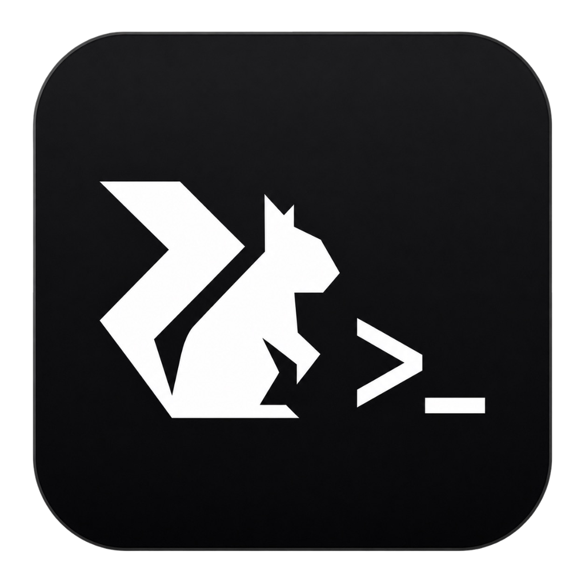
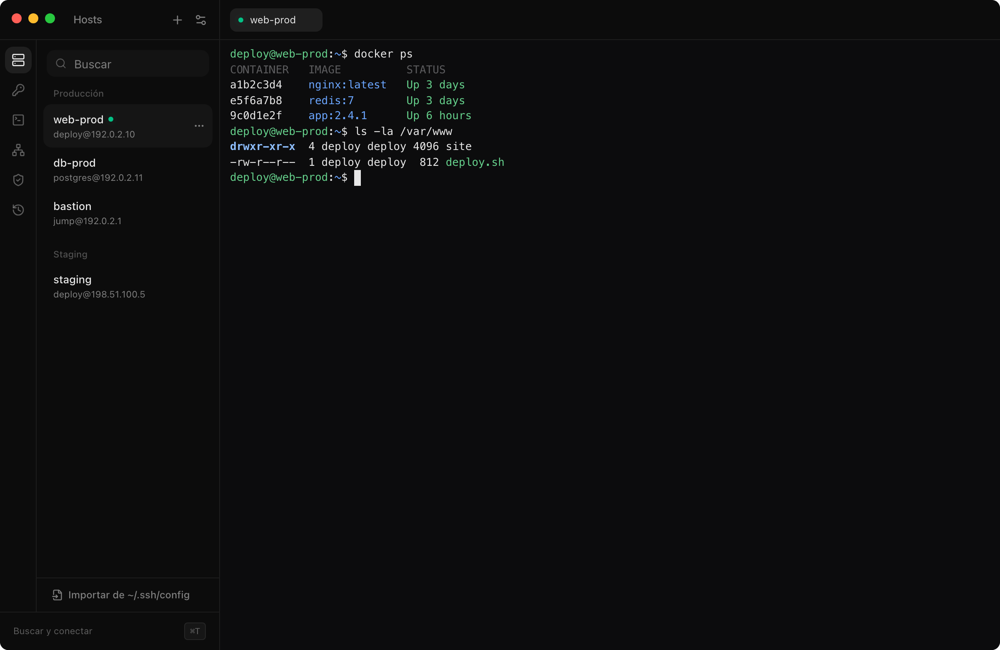

<div align="center">
  
  <h1>Ratatoskr</h1>
  <p><strong>Cliente SSH rápido, bonito y cifrado.</strong></p>
  <p><em>La ardilla que corre por Yggdrasil llevando mensajes entre los reinos.</em></p>
  <p>
    
    
    
  </p>
</div>

---

<div align="center">
  
</div>

Ratatoskr es un cliente SSH de escritorio para macOS, Windows y Linux. Terminal, SFTP,
túneles y bastiones en una sola app, con un vault cifrado de extremo a extremo y una
estética minimalista. Sin cuentas de terceros, sin telemetría, sin texto plano.

## Características

- **Terminal completo** — PTY real con `xterm-256color`, truecolor, ratón, redimensionado
  y `⌥` como Meta. tmux, vim, htop y compañía funcionan tal cual.
- **SFTP integrado** — explorador de archivos remoto: navegar, subir, bajar, editar sin descargar, crear carpetas,
  renombrar y eliminar, sin herramientas externas.
- **Túneles de puertos** — los tres modos con interfaz: local (`-L`), remoto (`-R`) y
  dinámico (`-D`, proxy SOCKS5). Llega a una base de datos o panel interno sin memorizar banderas.
- **Jump host / bastión** — conexión a través de una máquina puente (ProxyJump), en cadena
  y con detección de ciclos. El acceso corporativo por bastión, resuelto.
- **Reenvío del agente SSH** (`-A`) — usa tu `ssh-agent` local en el servidor para saltar a
  otras máquinas sin copiar la clave privada. Se activa por host.
- **Paneles divididos y broadcast** — varias sesiones en una rejilla y un comando que se
  ejecuta en todas a la vez.
- **Vault cifrado zero-knowledge** — Argon2id + ChaCha20-Poly1305. Tus contraseñas y claves
  nunca salen del dispositivo sin cifrar. Auto-bloqueo por inactividad.
- **Verificación TOFU** — la clave de cada servidor se registra en la primera conexión y se
  verifica en las siguientes. Si cambia, la conexión se rechaza.
- **Claves, fragmentos e historial** — detecta tus claves de `~/.ssh`, guarda comandos
  frecuentes y registra tus conexiones.
- **Import/export** — trae tus hosts desde `~/.ssh/config`, comparte hosts sin contraseñas,
  haz copia de seguridad completa del vault.
- **Actualizaciones automáticas** — firmadas criptográficamente, con aviso y confirmación.
- **A tu gusto** — 11 temas de terminal, opacidad con blur nativo, fuentes Nerd Font,
  estilo de cursor y tamaño configurables.

## Instalación

Descarga desde la
[**página de releases**](https://github.com/chefibecerra/ratatoskr/releases/latest):

| Plataforma | Instalador | Portable (sin instalar) |
|-----------|-----------|--------------------------|
| macOS (Apple Silicon / Intel) | `.dmg` | `.app.tar.gz` |
| Windows | `.exe` o `.msi` | `_portable.exe` |
| Linux | `.deb` o `.rpm` | `.AppImage` |

Los **portables** se ejecutan sin instalación ni permisos de administrador (el `.exe`
de Windows solo necesita WebView2, incluido en Windows 10/11).

> **macOS**: las compilaciones aún no están firmadas con Apple. Si Gatekeeper se queja,
> ejecuta `xattr -cr /Applications/Ratatoskr.app` una vez tras instalar.

## Compilar desde el código

Requisitos: [Rust](https://rustup.rs), [Node.js](https://nodejs.org) 20+ y
[pnpm](https://pnpm.io), más las
[dependencias de sistema de Tauri](https://tauri.app/start/prerequisites/).

```bash
pnpm install
pnpm tauri dev      # desarrollo con hot-reload
pnpm tauri build    # instalador de producción
```

## Seguridad

La regla de oro: **la contraseña maestra y las claves privadas nunca salen del dispositivo
sin cifrar.** Tu contraseña deriva una clave de 256 bits con Argon2id (nunca se guarda);
hosts, contraseñas y fragmentos se sellan con ChaCha20-Poly1305 en un único archivo
autenticado. Las claves públicas de los servidores se guardan aparte, como hace OpenSSH.

La lógica crítica (cifrado del vault, verificación TOFU, borrado de secretos al exportar)
está cubierta con tests unitarios.

## Stack

| Capa | Tecnología |
|------|------------|
| Shell de la app | Tauri 2 |
| Frontend | React 19 + TypeScript + Vite 7 |
| UI | Tailwind 4 + shadcn/ui |
| Terminal | xterm.js |
| SSH / SFTP | `russh` + `russh-sftp` (Rust puro) |
| Vault | Argon2id + ChaCha20-Poly1305 |

## Hoja de ruta

- [x] Terminal, hosts, sesiones en pestañas
- [x] Vault cifrado con master password y auto-bloqueo
- [x] Verificación TOFU de claves de servidor
- [x] SFTP, jump host, paneles divididos, broadcast
- [x] Editar archivos remotos con doble clic y resaltado de sintaxis
- [x] Túneles local (`-L`), remoto (`-R`) y dinámico (`-D`, SOCKS)
- [x] Reenvío del agente SSH (`-A`)
- [x] Icono en la barra de menú con conexión rápida (cierre a bandeja)
- [x] Actualizaciones automáticas firmadas
- [x] Instaladores y portables para las tres plataformas
- [ ] Sincronización entre dispositivos (el vault ya viaja por archivo; falta el transporte)
- [ ] Firma de código (Apple / Authenticode)

## Licencia

[MIT](LICENSE)
